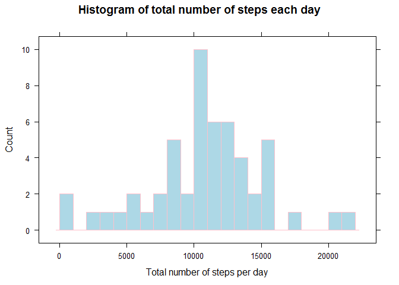
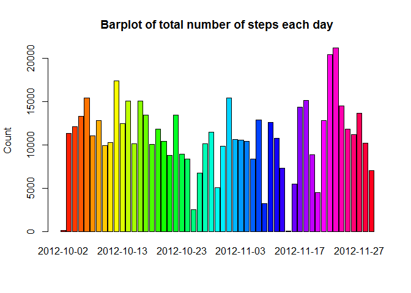
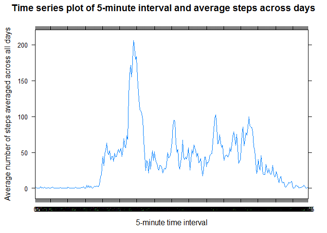
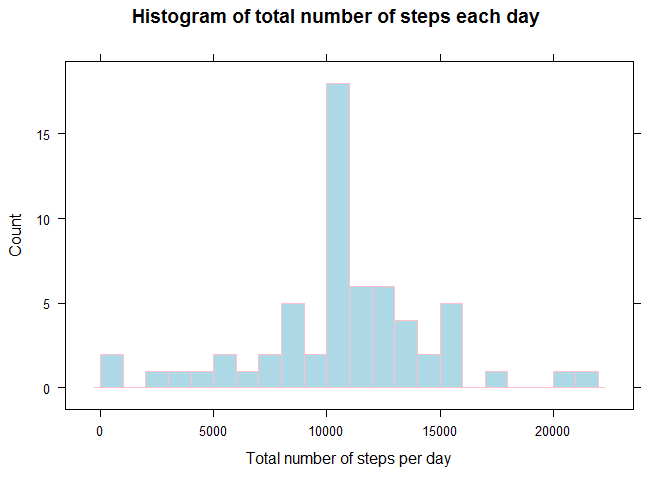
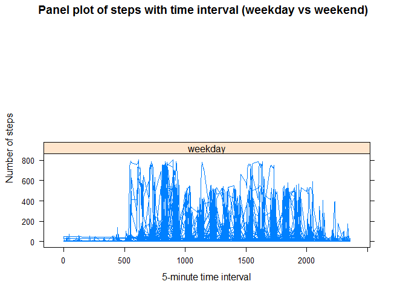

# Reproducible Research: Peer Assessment 1

## 0 Introduction
It is now possible to collect a large amount of data about personal movement using activity monitoring devices such as a Fitbit, Nike Fuelband, or Jawbone Up. These type of devices are part of the “quantified self” movement – a group of enthusiasts who take measurements about themselves regularly to improve their health, to find patterns in their behavior, or because they are tech geeks. But these data remain under-utilized both because the raw data are hard to obtain and there is a lack of statistical methods and software for processing and interpreting the data.

This assignment makes use of data from a personal activity monitoring device. This device collects data at 5 minute intervals through out the day. The data consists of two months of data from an anonymous individual collected during the months of October and November, 2012 and include the number of steps taken in 5 minute intervals each day.

## 1 Loading and preprocessing the data
### 1.1 Load the data (i.e. `read.csv()`)

```r
##Set environment
setwd("C:/Users/User/Desktop/Reproducible research/week02/") ##Default path
library(knitr)
library(ggplot2)
library(lattice)
library(xtable)
opts_chunk$set(echo = TRUE)
```


```r
##Download zip file
fileUrl <- "http://d396qusza40orc.cloudfront.net/repdata%2Fdata%2Factivity.zip"
download.file(fileUrl, destfile = "./repdata-data-activity.zip", mode = "wb")
timeDownload <- date()

##Load csv file after unzipping
unzip("./repdata-data-activity.zip")
activity <- read.csv("./activity.csv")
```
Time for downloading zip file is Mon Jun 15 02:14:17 2015.

### 1.2 Process/transform the data (if necessary) into a format suitable for your analysis

```r
##Transform dataset into data frame
activity <- as.data.frame(activity)
activity.dim <- dim(activity)
activity.names <- names(activity)
```
This dataset has 17568 observations and 3 variables.
Variable names are (steps, date, interval).

## 2 What is mean total number of steps taken per day?
### 2.1 Calculate the total number of steps taken per day

```r
##Ignore NA
activity.new <- activity[which(!is.na(activity$steps)),]

##Total number of steps in all days
totalStep <- sum(activity.new$steps)
totalStep
```

```
## [1] 570608
```

```r
##Total number of steps per day
dateFactor <- factor(activity.new$date)
totalStepPerDay <- tapply(activity.new$steps, dateFactor, FUN = sum) ##Array
totalStepPerDay
```

```
## 2012-10-02 2012-10-03 2012-10-04 2012-10-05 2012-10-06 2012-10-07 
##        126      11352      12116      13294      15420      11015 
## 2012-10-09 2012-10-10 2012-10-11 2012-10-12 2012-10-13 2012-10-14 
##      12811       9900      10304      17382      12426      15098 
## 2012-10-15 2012-10-16 2012-10-17 2012-10-18 2012-10-19 2012-10-20 
##      10139      15084      13452      10056      11829      10395 
## 2012-10-21 2012-10-22 2012-10-23 2012-10-24 2012-10-25 2012-10-26 
##       8821      13460       8918       8355       2492       6778 
## 2012-10-27 2012-10-28 2012-10-29 2012-10-30 2012-10-31 2012-11-02 
##      10119      11458       5018       9819      15414      10600 
## 2012-11-03 2012-11-05 2012-11-06 2012-11-07 2012-11-08 2012-11-11 
##      10571      10439       8334      12883       3219      12608 
## 2012-11-12 2012-11-13 2012-11-15 2012-11-16 2012-11-17 2012-11-18 
##      10765       7336         41       5441      14339      15110 
## 2012-11-19 2012-11-20 2012-11-21 2012-11-22 2012-11-23 2012-11-24 
##       8841       4472      12787      20427      21194      14478 
## 2012-11-25 2012-11-26 2012-11-27 2012-11-28 2012-11-29 
##      11834      11162      13646      10183       7047
```
Total number of steps in all days is 570608.
Total number of steps per day is [126, 11352, 12116, 13294, 15420, 11015, 12811, 9900, 10304, 17382, 12426, 15098, 10139, 15084, 13452, 10056, 11829, 10395, 8821, 13460, 8918, 8355, 2492, 6778, 10119, 11458, 5018, 9819, 15414, 10600, 10571, 10439, 8334, 12883, 3219, 12608, 10765, 7336, 41, 5441, 14339, 15110, 8841, 4472, 12787, 20427, 21194, 14478, 11834, 11162, 13646, 10183, 7047].

### 2.2 If you do not understand the difference between a histogram and a barplot, research the difference between them. Make a histogram of the total number of steps taken each day

```r
##Histogram
histogram(totalStepPerDay, 
          breaks = 20,
          xlab = "Total number of steps per day",
          main = "Histogram of total number of steps each day",
          col = "lightblue",
          border = "pink",
          type = "count"
          )
```

 

```r
##Barplot
barplot(totalStepPerDay, 
        beside = TRUE, 
        args.legend = list(bty = "n", horiz = TRUE),
        col = rainbow(length(totalStepPerDay)),
        border = "black",
        ylab = "Count",
        main = "Barplot of total number of steps each day"
        )
```

 

### 2.3 Calculate and report the mean and median of the total number of steps taken per day

```r
##Mean of total number of steps taken per day
meanStep <- round(mean(totalStepPerDay), 2)
meanStep
```

```
## [1] 10766.19
```

```r
##Median of total number of steps taken per day
medianStep <- round(median(totalStepPerDay), 2)
medianStep
```

```
## [1] 10765
```
Mean of total number of steps taken per day is 1.076619\times 10^{4}.
Median of total number of steps taken per day is 1.0765\times 10^{4}.

## 3 What is the average daily activity pattern?
### 3.1 Make a time series plot (i.e. `type = "l"`) of the 5-minute interval (x-axis) and the average number of steps taken, averaged across all days (y-axis)

```r
##Average number of steps taken averaged across all days
intervalFactor <- factor(activity.new$interval) ##Factorize interval
levelIntervalFactor <- nlevels(intervalFactor) ##Levels of interval factor
intervalFactor <- unique(intervalFactor)
avgStep <- tapply(activity.new$steps, factor(activity.new$interval), FUN = mean, na.rm = TRUE) ##array
```

```r
xyplot(avgStep ~ intervalFactor,
       type = "l",
       xlab = "5-minute time interval",
       ylab = "Average number of steps averaged across all days",
       main = "Time series plot of 5-minute interval and average steps across days"
       )
```

 

### 3.2 Which 5-minute interval, on average across all the days in the dataset, contains the maximum number of steps?

```r
##Time interval with maximum average steps across all days
dfAvgStep <- as.data.frame(avgStep)
maxStep <- max(dfAvgStep$avgStep) ##Maximum value of average steps across all days
maxStepInterval <- dfAvgStep[which(dfAvgStep$avgStep == maxStep), 1] ##Select that row
maxIntervalStep <- as.data.frame(maxStepInterval)

##Maximum average steps across all days and corresponding interval
maxIntervalStep
```

```
##     maxStepInterval
## 835        206.1698
```
The interval 835 has maximum average steps across all days which is 206.1698113.

## 4 Imputing missing values
Note the there are a number of days/intervals where there are missing values (coded as **NA**). The presence of missing days may introduce bias into some calculations or summaries of the data.
### 4.1 Calculate and report the total number of missing values in the dataset (i.e. the total number of rows with **NA**s)

```r
##Count number of missing values NA
numNA <- length(activity[which(is.na(activity$steps)), "steps"])
numNA
```

```
## [1] 2304
```
Total number is missing values in the dataset indicated as NA is 2304.

### 4.2 Devise a strategy for filling in all of the missing values in the dataset. The strategy does not need to be sophisticated. For example, you could use the mean/median for that day, or the mean for that 5-minute interval, etc.
It is feasible to impute mean steps for that 5-minute interval if encountering missing values. Mean steps can be found in data frame **dfAvgStep**. We can match by variable **interval**.

### 4.3 Create a new dataset that is equal to the original dataset but with the missing data filled in.

```r
##Create new copy of original dataset activity
activity.copy <- activity
activity.copy[, "steps"] <- as.numeric(activity.copy[, "steps"]) #Integer->Numeric

##Inpute missing values: Using mean for that 5-minute interval from dfAvgStep
for (row in 1:nrow(activity.copy)) {
  
  if (is.na(activity.copy[row, "steps"])) {
    
    matchInterval <- as.character(activity.copy[row, "interval"]) ##Select for match
    activity.copy[row, "steps"] <- dfAvgStep[matchInterval, 1] 
    
  } ##End if
  
} ##End for
```

### 4.4 Make a histogram of the total number of steps taken each day and Calculate and report the **mean** and **median** total number of steps taken per day. Do these values differ from the estimates from the first part of the assignment? What is the impact of imputing missing data on the estimates of the total daily number of steps?

```r
##Total number of steps per day
newDateFactor <- factor(activity.copy$date) ##New date factor
newTotalStepPerDay <- tapply(activity.copy$steps, newDateFactor, FUN = sum) ##Array

##Histogram of total number of steps taken each day
histogram(newTotalStepPerDay, 
          breaks = 20,
          xlab = "Total number of steps per day",
          main = "Histogram of total number of steps each day",
          col = "lightblue",
          border = "pink",
          type = "count"
          )
```

 

```r
##Mean of total number of steps taken per day
newMeanStep <- round(mean(newTotalStepPerDay), 2)
newMeanStep
```

```
## [1] 10766.19
```

```r
##Median of total number of steps taken per day
newMedianStep <- round(median(newTotalStepPerDay), 2)
newMedianStep
```

```
## [1] 10766.19
```
Mean of total number of steps taken per day is 1.076619\times 10^{4}.
Median of total number of steps taken per day is 1.076619\times 10^{4}.

After imputing missing values using mean for that 5-minute interval, mean value does not change but median value increases toward mean value. In other words, median value is below mean value before imputing but two values converge after imputing.

## 5 Are there differences in activity patterns between weekdays and weekends?
For this part the `weekdays()` function may be of some help here. Use the dataset with the filled-in missing values for this part.
### 5.1 Create a new factor variable in the dataset with two levels-"weekday" and "weekend" indicating whether a given date is a weekday or weekend day.

```r
##Create new variable "day" to indicate (Sun, Mon, Tue, Wed, Thr, Fri, Sat)
activity.copy$day <- weekdays(as.Date(activity.copy$date))

##Create variable "whichday" to indicate weekday or weekend day
activity.copy$whichday <- "Empty" ##Initialize
for (row in 1:nrow(activity.copy)) {
  
  if (activity.copy[row, ]$day %in% c("星期六", "星期日")) { ##Saturday and Sunday in Chinese
  
    activity.copy[row, ]$whichday <- "weekend"
  
  }else {
  
  activity.copy[row, ]$whichday <- "weekday" 
  
  } ##End if

} ##End for
```

### 5.2 Make a panel plot containing a time series plot (i.e. `type = "l"`) of the 5-minute interval (x-axis) and the average number of steps taken, averaged across all weekday days or weekend days (y-axis). See the README file in the GitHub repository to see an example of what this plot should look like using simulated data.

```r
##Panel plot: time-series of interval, average number of steps, averaged across weekdays or weekends
xyplot(activity.copy$steps ~ activity.copy$interval | activity.copy$whichday, 
       layout = c(1, 2),
       type = "l",
       xlab = "5-minute time interval",
       ylab = "Number of steps",
       main = "Panel plot of steps with time interval (weekday vs weekend)"
       )
```

 

